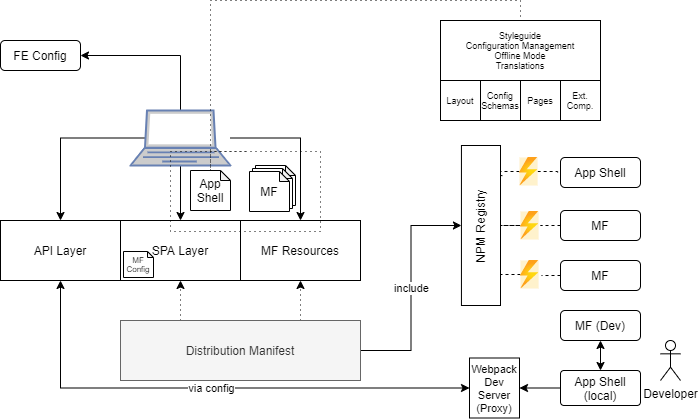

# Architecture Overview

Below you'll find an architecture diagram connecting the parts from the core application with the (frontend) ecosystem.



The app shell is the central piece that actually connects

- the framework,
- the microfrontends, and
- the backend

together.

## The Different Pieces

The framework is an NPM package called `@openmrs/esm-framework`, which is composed of multiple smaller libraries such as

- `@openmrs/esm-api` (responsible for calls to the backend)
- `@openmrs/esm-breadcrumbs` (management of UI breadcrumbs)
- `@openmrs/esm-config` (validation and storage of frontend configuration)
- `@openmrs/esm-error-handling` (handling of errors)
- `@openmrs/esm-extensions` (implementation of a frontend component extension system)
- `@openmrs/esm-globals` (useful global variables and types)
- `@openmrs/esm-offline` (provides offline functionality)
- `@openmrs/esm-react-utils` (utilities for React components)
- `@openmrs/esm-state` (brings in state management)
- `@openmrs/esm-styleguide` (styling and UI capabilities)
- `@openmrs/esm-utils` (general utility and helper functions)

The microfrontends are shipped in the ES Module format and usually thus just called `esm`s (same prefix as the libraries). In any case these microfrontends are indeed also libraries, but very special ones that

- are not directly bundled (i.e., integrated) into the main application,
- are loaded indirectly via a special JSON called an "import map", and they
- export a predefined set of functionality, e.g., a function called `setupOpenMRS`.

These microfrontends bring in domain-specific UI capabilities such as menu entries, page content, or notifications. In many cases they also come with dedicted offline capabilities, which allow, e.g., registration or modifications of (selected) patients while not being connected.

The backend can be freely selected using the OpenMRS 3.0 SPA solution. Since the MF part is really just a set of static files that can be served from literally anywhere, the backend might be proxied or consist of multiple independently running docker images. The specific setup is up to you. Usually, though, you'd run a "standard" OpenMRS distribution that pretty much integrates all the different components already.

Let's have a look how this might work in practice.

## Example Distribution

To create an example distribution using the OpenMRS 3.0 SPA as frontend you'll need to think of three things:

1. The app shell (namely what settings you'll need to include it)
2. What microfrontends to include (their names and versions)
3. The configuration for these microfrontends

The parts of (2) and (3) also flow in directly or indirectly into the settings defined for (1).

Let's start with (1):

```sh
npx openmrs build --spa-path /openmrs/spa/ --api-url /openmrs/ --config-url config.json --importmap importmap.json
```

Using this command you'll build a new app shell that will be placed at `/openmrs/spa/`. The OpenMRS API is supposed to be on the same server (at least reachable from the browser) at `/openmrs/` (e.g., a call to `/openmrs/ws/rest/v1/session` yields the session, so `/ws` is rooted at `/openmrs`).

The command above also defines two more things: The microfrontends from (3) are determined by an *importmap.json* which will be available in the same directory as the SPA (i.e., reachable at `/openmrs/spa/` from the browser). Likewise, a configuration file is specified; the file *config.json* will be loaded from the SPA's path, too.

Now that you'll have your files for the app shell its time to look at how to get the remaining ones.

The microfrontends from (2) can be assembled using:

```sh
npx openmrs assemble --mode survey
```

This will run a command-line survey iterating over all (publicly) available microfrontends. If included, the survey will ask you what version to take.

Once completed, you'll have a valid *importmap.json* as well as a directory with all files corresponding to the different microfrontends referenced in this *importmap.json*.

Finally, you'll also need a configuration. Ideally, you can just write some JSON that represents such a configuration, however, in the real world this will not be so easy.

Our recommended approach is to actually start with an empty JSON file just containing `{}`. With this empty configuration you can fire up your application shell and actually set it all up as you want to. The microfrontend `@openmrs/esm-implementer-tools-app` will help you to do exactly that.

When you completed your customization in the frontend you can download your individual *config.json*. Now you can put it besides all the other files to complete your own distribution.

## Startup

When the application loads it goes through the following steps.

1. Preloads the importmap and related files
2. Evaluates the stylesheets and scripts
3. Configures the SPA application
4. Installs the service worker for offline capabilities
5. Loads and evaluates the different microfrontends from the importmap
6. Loads and validates the provided configurations
7. Sets up the offline capabilities and synchronization features
8. Renders the UI

Once the UI is rendered the content is exclusively coming from the different microfrontends. The app shell sees its role soley as an orchestration layer.

## Language Detection

The OpenMRS 3.0 SPA is fully localized. New languages can be added on demand. Each microfrontend herein delivers its own language fragments. Overall, the well known `i18next` solution is taken to manage languages.

The identify the currently used language the following steps are performed:

1. Looking at the site's current query string (`lng`)
2. Looking at the user's language preference placed on the `html` tag, which is synced with the backend
3. Looking at the site's language preference stored in `localStorage` (key `i18nextLng`)
4. Looking at the browser's language preference via `navigator` (trying properties such as `languages`, `userLanguage`, `language`)
5. Falling back to English ("en")

In any case changing the language on the fly is as simple as changing the `lang` attribute on the site's `documentElement`.
