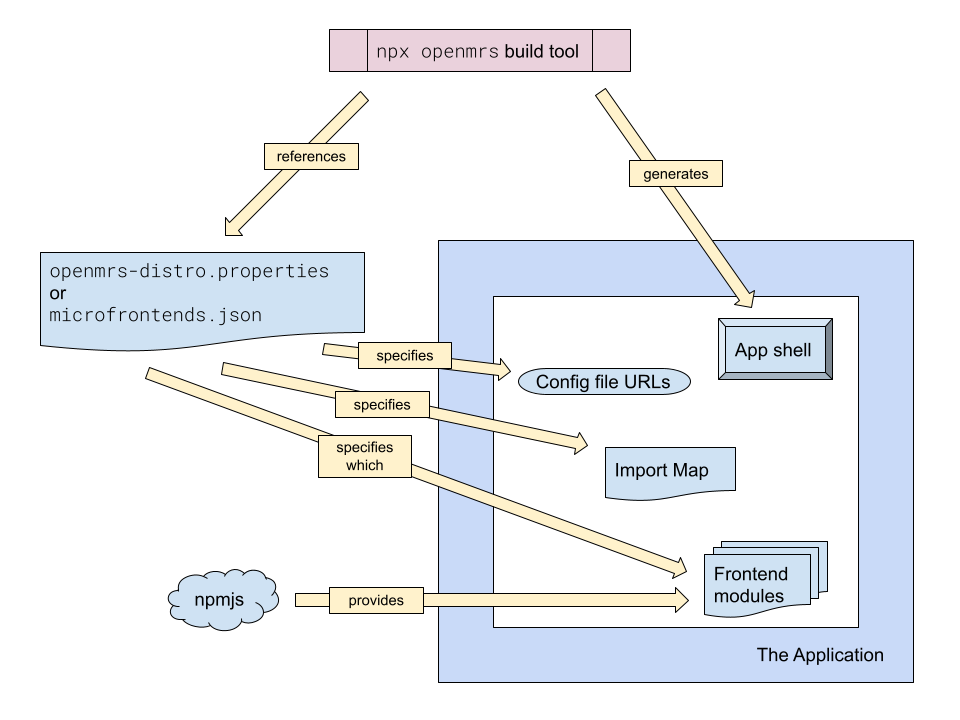
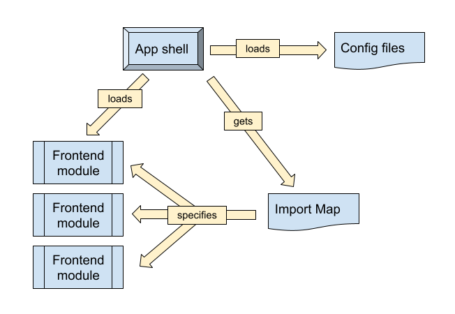

# Map of the Project

## Orientation

OpenMRS Frontend 3.0 uses a microfrontends architecture. We call our microfrontends "frontend modules." A frontend module is a self-contained piece of application. It has some UI, and some ideas about where in the application it should be rendered. Each frontend module can be configured, and some aspects of how frontend modules interact can be configured, too.

There are four important pieces of the OpenMRS Frontend modules system:

- The **app shell**, which is the "base" of the application and coordinates everything
- The **framework**, which is a library that all frontend modules use
- The **import map**, which is a file that tells the app shell what frontend modules to use and where they are
- The **frontend modules**, from which the interface is composed

The frontend modules communicate with the **backend**, which is the OpenMRS server, using its APIs.

### The framework

The **framework** is an NPM package called `@openmrs/esm-framework`, which is composed of multiple smaller libraries. These are documented in the
[OpenMRS Frontend Core README](https://github.com/openmrs/openmrs-esm-core#openmrs-frontend-core).

### The frontend modules

The **frontend modules** are shipped in the ES Module format and usually thus just called `esm`s (same prefix as the libraries). In any case these frontend modules are indeed also libraries, but very special ones that

- are not directly integrated into the main application,
- are loaded indirectly via a special JSON called an "import map", and they
- export a predefined set of functionality including a function called `setupOpenMRS`.

These frontend modules bring in domain-specific UI capabilities such as menu entries, page content, or notifications.

#### Understanding frontend modules :brain:

All the pieces of a frontend module are explained in
[Tour of a Frontend Module](../getting_started/tour.md).

Also see the
**[openmrs-esm-template-app](https://github.com/openmrs/openmrs-esm-template-app)**,
which explains lots of things about frontend modules.

### The backend

The backend is an OpenMRS server and its APIs. The frontend application and backend server do not have to be colocated. Since the frontend really just a set of static files, it can be served from anywhere. The specific setup is up to you.

## Structure of the application

The process of building an application, which is described in the
[Implementer Documentation](https://wiki.openmrs.org/pages/viewpage.action?pageId=224527013),
looks like this:

<!-- https://docs.google.com/drawings/d/1TZy8k4x3sb6El6-vND2FgBC62BagHB4r32M--Kvxorg/edit -->

The built application is then executed on the client like this:

<!-- https://docs.google.com/drawings/d/1myQ4ETSX35-fM1AtGNLnJRTtGqY4AmHzJvlgxotl82c/edit -->

## Repositories you should know :octocat:	
The 3.x EMR Reference Application is made up of all the frontend modules found in the following repositories:

- :construction: [openmrs-esm-template-app](https://github.com/openmrs/openmrs-esm-template-app): This repository provides a starting point for creating your own OpenMRS Microfrontend.
- [openmrs-esm-core](https://github.com/openmrs/openmrs-esm-core/tree/master/packages/apps): Frontend modules which are administrative or else integral to the application
- [openmrs-esm-patient-management](https://github.com/openmrs/openmrs-esm-patient-management/tree/main/packages): Frontend modules which deal with creating, searching, and listing patients
- [openmrs-esm-patient-chart](https://github.com/openmrs/openmrs-esm-patient-chart/tree/master/packages): The patient chart frontend module and all its widgets
- [openmrs-esm-home](https://github.com/openmrs/openmrs-esm-home/tree/master/packages): Frontend modules tied to the home page
- [openmrs-rfc-frontend](https://github.com/openmrs/openmrs-rfc-frontend): A git repository that facilitates a democratic process where folks can propose changes to the frontend implementation via RFCs (Request For Comments). See, for example, the [Contributing Guidelines for Frontend Modules](https://github.com/openmrs/openmrs-rfc-frontend/blob/master/text/0020-contributing-guidelines.md), which were established with RFC #20.
